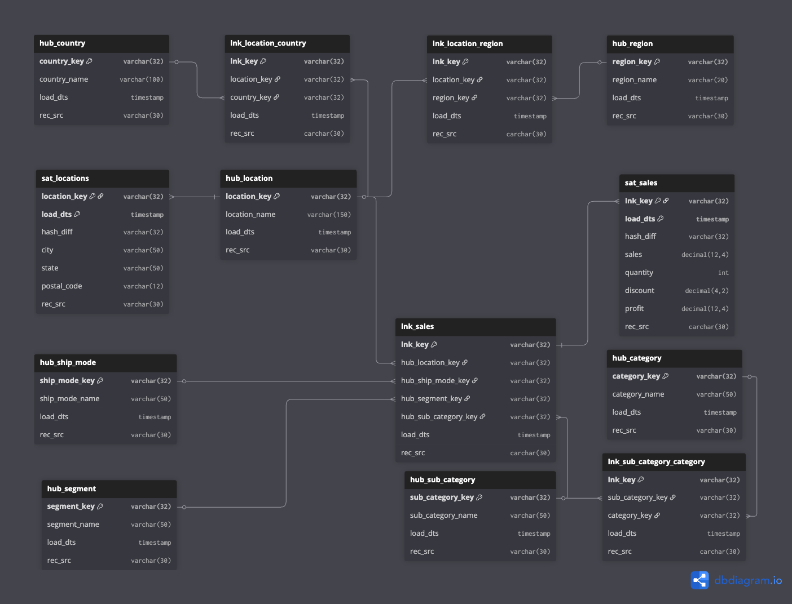

# Системы хранения данных. Домашнее задание по модулю 5.

## Диаграмма модели Data Vault

### Структура хранилища

**Исходные данные**
- Создана таблица `superstore` c сырыми данными файла `SampleSuperstore` в качестве источника данных.

**Хабы**
- `hub_ship_mode` — способы доставки
- `hub_segment` — сегменты клиентов
- `hub_country` — страны
- `hub_location` — локации, хаб содержит достаточную информацию, чтобы однозначно идентифицировать точку на карте. В самом хабе храним только наименование локации, а атрибуты в сателлите.
- `hub_region` — регионы
- `hub_category` — категории товаров
- `hub_sub_category` — подкатегории товаров

**Линки**
- `lnk_location_country` — связь локации и страны. Необходима для выяснения страны по локации.
- `lnk_location_region` — связь локации и региона. Уточняет регион локации
- `lnk_sub_category_category` — иерархия подкатегории и категории. 
- `lnk_sales` — информация о продажах в разрезе локации, способов доставки, сегментов и подкатегорий.

**Сателлиты**
- `sat_locations` — атрибуты локации (город, штат, почтовый индекс)
- `sat_sales` — количественные показатели продаж.

### Информация о файлах
Скрипты создания и заполнения таблиц хранилища расположены в `./scripts/`
